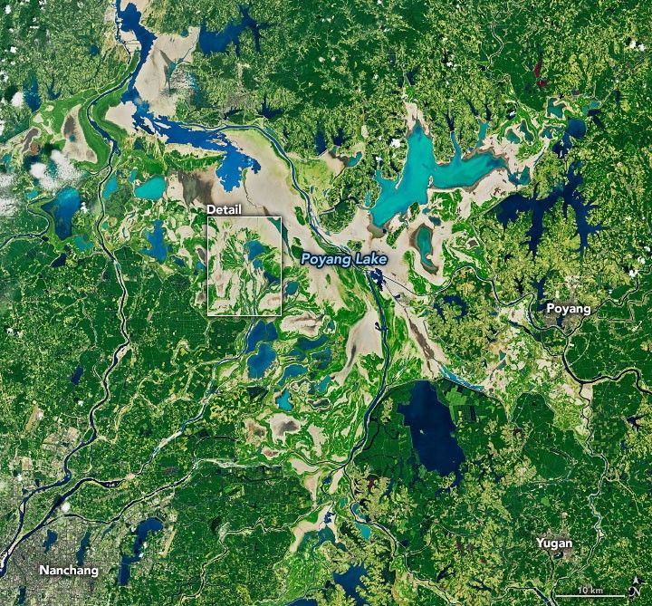
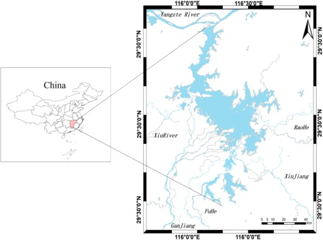

::: text-center

{width="250px"}

# **Exploring Change:**

## Land Cover Classification of Lake Poyang, China 
## (1988 - 2023)

 

:::

::: text-center
### Research Objective :

“To analyze long-term spatial and temporal changes in the surface water extent of Lake Poyang using Landsat Level-2 thermal emissivity data from 1988 to 2023.” 

:::

## Abstract

Poyang Lake, China’s largest freshwater lake, has experienced major hydrological and environmental changes over the past several decades due to climate variability, seasonal flooding and drought cycles, anthropological activities, and large-scale hydrological modifications such as the operation of the Three Gorges Dam. The lake experiences extreme seasonal fluctuations in water extent.The water coverage expands during wet summer months and shrinks drastically during dry periods. Monitoring these long-term surface water changes is important for understanding ecological change, flood and drought vulnerability, wetland sustainability, and regional water resource management.
This project investigates the spatial and temporal changes in the surface water extent of Poyang Lake between 1988 and 2023 using Landsat imagery and remote sensing techniques.Results showed fluctuations in lake extent, with maximum water coverage observed in 2014 and an overall decline of approximately 495 km² between 1988 and 2023.  
Previous studies have shown that droughts, flooding events, sand mining, sediment changes, and hydrological regulation have altered the lake’s morphology and ecological conditions over time. The findings of this project contribute to a better understanding of long-term lake dynamics and demonstrate the effectiveness of remote sensing techniques for monitoring environmental change in large lake systems.

::: {.columns}

::: {.column width="50%" style="padding-right:10px;}

{width="100%"}

:::

::: {.column width="50%" style="padding-left:10px;}

{width="100%"}

:::

:::

## Introduction

Poyang Lake, located in Jiangxi Province in southeastern China, is the largest freshwater lake in China and one of the most ecologically significant wetland systems in East Asia. This lake plays an important role in regional hydrology, biodiversity conservation, flood regulation, water storage, fisheries and agriculture. It is connected to the Yangtze River and receives inflow from five major tributaries, creating a complex and dynamic hydrological system. 
Unlike many permanent lakes, Poyang Lake experiences dramatic seasonal fluctuations in water level and surface area throughout the year. During the summer monsoon season, increased precipitation and river inflow expand the lake area significantly, while during winter and drought periods, the lake shrinks and exposes large wetland and floodplain areas. Studies have shown that the water extent of Poyang Lake can fluctuate by several thousand square kilometers between wet and dry seasons. These variations are important indicators of environmental change and directly affect wetland ecosystems, migratory bird habitats, agriculture, fisheries, and surrounding human settlements.
In recent decades, Poyang Lake has experienced increasing environmental stress by both natural and anthropogenic factors. The extreme drought event of 2022 reduced the lake area and water levels, which exposed large portions of the lakebed and raised concerns about ecosystem degradation and water security. In addition, large-scale human activities such as sand mining, urbanization, agricultural intensification, and building the Three Gorges Dam have altered sediment transport, hydrological connectivity, and water dynamics within the lake system.
Because of its large size and dynamic seasonal behavior, monitoring changes in Poyang Lake through traditional field-based methods is difficult and time consuming. Remote sensing provides an effective solution for long-term environmental monitoring by which we can repeatedly observe surface water changes over large geographical areas. Satellite imagery from the Landsat program has been widely used in hydrological and environmental studies because of its long temporal coverage, moderate spatial resolution, and accessibility. Water extraction techniques such as emissivity band, NDWI, and NDVI enable us to distinguish water surfaces from vegetation and other land cover types. 
The purpose of this study is to analyze the long-term spatial and temporal changes in the surface water extent of Poyang Lake between 1988 and 2023. Although previous studies have examined hydrological changes in Poyang Lake, fewer studies have focused specifically on emissivity-based thermal remote sensing approaches for long-term water extraction using multi-decadal Landsat Level-2 products. This project uses Landsat Level-2 emissivity data to classify water and non-water areas and quantify changes in lake area over time. By comparing five Landsat datasets between 1988 and 2023, this study evaluates long-term hydrological variability using emissivity-based binary water classification.  The findings of this study contribute to a broader understanding of freshwater lake dynamics and highlight the value of remote sensing techniques in environmental monitoring.

## Study Area
Poyang Lake is located in Jiangxi Province in southeastern China and is the largest freshwater lake in China. The lake lies along the southern bank of the middle reaches of the Yangtze River and forms an important part of the Yangtze River floodplain system. Geographically, Poyang Lake is situated approximately between 28°24′N–29°46′N latitude and 115°49′E–116°46′E longitude. The lake occupies a strategically important hydrological and ecological position within the Yangtze River Basin and serves as a major freshwater storage and flood regulation system in the region.

Poyang Lake is a seasonal floodplain lake with highly dynamic hydrological behavior. The lake receives water primarily from five major tributaries: the Ganjiang River, Fuhe River, Xinjiang River, Raohe River, and Xiuhe River. These rivers discharge into the lake before the water eventually flows northward into the Yangtze River near Hukou County. The interaction between tributary inflow and the Yangtze River creates complex seasonal fluctuations in water level and surface area.

The surface area of Poyang Lake varies seasonally from less than 1,000 km² during dry periods to more than 3,000 km² during flood seasons. It has a subtropical humid monsoon climate which is hot, humid in summers and mild cold in winters. Annual precipitation generally ranges between 1350 mm and 2150 mm, with most rainfall between April and June during the East Asian monsoon season. Average annual temperatures are approximately 17–18°C. Seasonal rainfall and monsoon patterns strongly influence the hydrology of the lake, as a result of which the lake expands during wet periods and shrinks during the dry season.

The lake is internationally recognized for its ecological importance and is designated as a wetland of global significance under the Ramsar Convention. It supports biodiversity conservation, fisheries, agriculture, transportation, and freshwater supply for surrounding communities.
The unique hydrological behavior, ecological importance, and increasing environmental stress make Poyang Lake an important study area for long-term remote sensing analysis and environmental monitoring.

