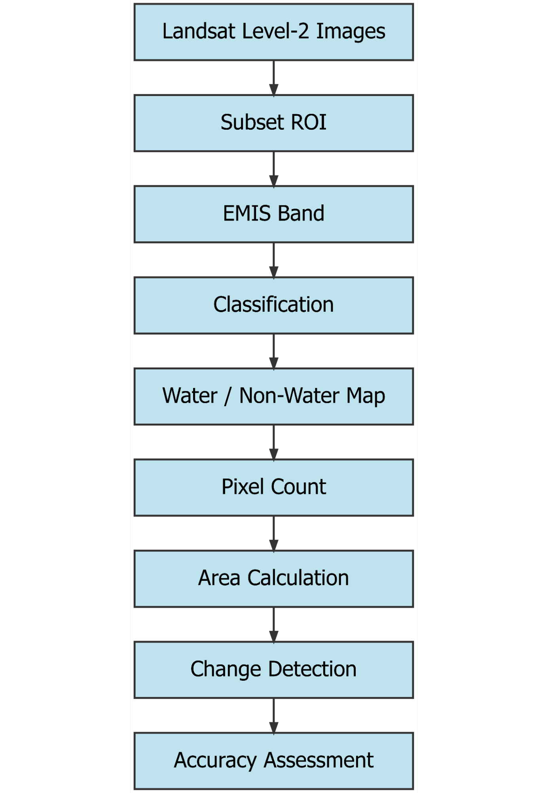
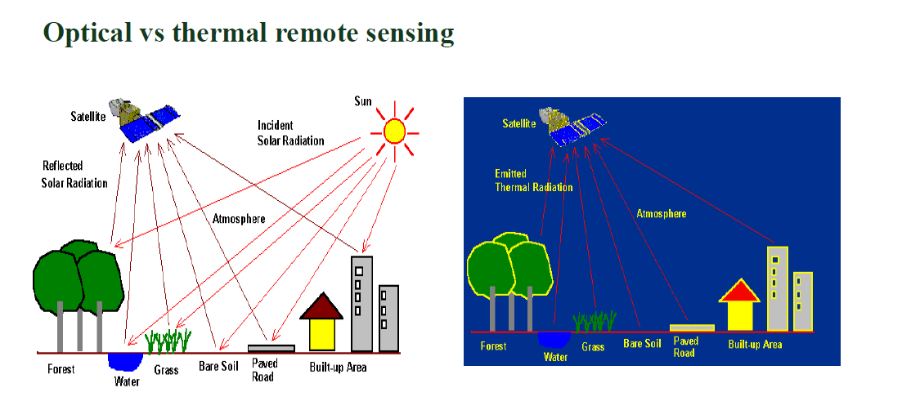

::: text-center
{width="250px"}

# **Exploring Change:**

## Land Cover Classification of Lake Poyang, China

## (1988 - 2023)

:::

::: text-center
### Research Objective

“To analyze long-term spatial and temporal changes in the surface water extent of Lake Poyang using Landsat Level-2 thermal emissivity data from 1988 to 2023.”
:::

## Abstract

Poyang Lake, China’s largest freshwater lake, has experienced major hydrological and environmental changes over the past several decades due to climate variability, seasonal flooding and drought cycles, anthropological activities, and large-scale hydrological modifications such as the operation of the Three Gorges Dam. The lake experiences extreme seasonal fluctuations in water extent.The water coverage expands during wet summer months and shrinks drastically during dry periods. Monitoring these long-term surface water changes is important for understanding ecological change, flood and drought vulnerability, wetland sustainability, and regional water resource management. This project investigates the spatial and temporal changes in the surface water extent of Poyang Lake between 1988 and 2023 using Landsat imagery and remote sensing techniques.Results showed fluctuations in lake extent, with maximum water coverage observed in 2014 and an overall decline of approximately 495 km² between 1988 and 2023.\
Previous studies have shown that droughts, flooding events, sand mining, sediment changes, and hydrological regulation have altered the lake’s morphology and ecological conditions over time. The findings of this project contribute to a better understanding of long-term lake dynamics and demonstrate the effectiveness of remote sensing techniques for monitoring environmental change in large lake systems.

::::: columns
::: {.column width="50%" style="\"padding-right:10px;"}
{width="100%"}
:::

::: {.column width="50%" style="\"padding-left:10px;"}
{width="100%"}
:::
:::::

## Introduction

Poyang Lake, located in Jiangxi Province in southeastern China, is the largest freshwater lake in China and one of the most ecologically significant wetland systems in East Asia. This lake plays an important role in regional hydrology, biodiversity conservation, flood regulation, water storage, fisheries and agriculture. It is connected to the Yangtze River and receives inflow from five major tributaries, creating a complex and dynamic hydrological system. Unlike many permanent lakes, Poyang Lake experiences dramatic seasonal fluctuations in water level and surface area throughout the year. During the summer monsoon season, increased precipitation and river inflow expand the lake area significantly, while during winter and drought periods, the lake shrinks and exposes large wetland and floodplain areas. Studies have shown that the water extent of Poyang Lake can fluctuate by several thousand square kilometers between wet and dry seasons. These variations are important indicators of environmental change and directly affect wetland ecosystems, migratory bird habitats, agriculture, fisheries, and surrounding human settlements. In recent decades, Poyang Lake has experienced increasing environmental stress by both natural and anthropogenic factors. The extreme drought event of 2022 reduced the lake area and water levels, which exposed large portions of the lakebed and raised concerns about ecosystem degradation and water security. In addition, large-scale human activities such as sand mining, urbanization, agricultural intensification, and building the Three Gorges Dam have altered sediment transport, hydrological connectivity, and water dynamics within the lake system. Because of its large size and dynamic seasonal behavior, monitoring changes in Poyang Lake through traditional field-based methods is difficult and time consuming. Remote sensing provides an effective solution for long-term environmental monitoring by which we can repeatedly observe surface water changes over large geographical areas. Satellite imagery from the Landsat program has been widely used in hydrological and environmental studies because of its long temporal coverage, moderate spatial resolution, and accessibility. Water extraction techniques such as emissivity band, NDWI, and NDVI enable us to distinguish water surfaces from vegetation and other land cover types. The purpose of this study is to analyze the long-term spatial and temporal changes in the surface water extent of Poyang Lake between 1988 and 2023. Although previous studies have examined hydrological changes in Poyang Lake, fewer studies have focused specifically on emissivity-based thermal remote sensing approaches for long-term water extraction using multi-decadal Landsat Level-2 products. This project uses Landsat Level-2 emissivity data to classify water and non-water areas and quantify changes in lake area over time. By comparing five Landsat datasets between 1988 and 2023, this study evaluates long-term hydrological variability using emissivity-based binary water classification. The findings of this study contribute to a broader understanding of freshwater lake dynamics and highlight the value of remote sensing techniques in environmental monitoring.

## Study Area

Poyang Lake is located in Jiangxi Province in southeastern China and is the largest freshwater lake in China. The lake lies along the southern bank of the middle reaches of the Yangtze River and forms an important part of the Yangtze River floodplain system. Geographically, Poyang Lake is situated approximately between 28°24′N–29°46′N latitude and 115°49′E–116°46′E longitude. The lake occupies a strategically important hydrological and ecological position within the Yangtze River Basin and serves as a major freshwater storage and flood regulation system in the region.

Poyang Lake is a seasonal floodplain lake with highly dynamic hydrological behavior. The lake receives water primarily from five major tributaries: the Ganjiang River, Fuhe River, Xinjiang River, Raohe River, and Xiuhe River. These rivers discharge into the lake before the water eventually flows northward into the Yangtze River near Hukou County. The interaction between tributary inflow and the Yangtze River creates complex seasonal fluctuations in water level and surface area.

The surface area of Poyang Lake varies seasonally from less than 1,000 km² during dry periods to more than 3,000 km² during flood seasons. It has a subtropical humid monsoon climate which is hot, humid in summers and mild cold in winters. Annual precipitation generally ranges between 1350 mm and 2150 mm, with most rainfall between April and June during the East Asian monsoon season. Average annual temperatures are approximately 17–18°C. Seasonal rainfall and monsoon patterns strongly influence the hydrology of the lake, as a result of which the lake expands during wet periods and shrinks during the dry season.

The lake is internationally recognized for its ecological importance and is designated as a wetland of global significance under the Ramsar Convention. It supports biodiversity conservation, fisheries, agriculture, transportation, and freshwater supply for surrounding communities. The unique hydrological behavior, ecological importance, and increasing environmental stress make Poyang Lake an important study area for long-term remote sensing analysis and environmental monitoring.

## Data

### Satellite Data

This study uses Landsat imagery to analyze long-term changes in the surface water extent of Poyang Lake between 1988 and 2023. Landsat imagery was selected because of its long historical archive, moderate spatial resolution, and suitability for environmental monitoring and land cover analysis. All images were acquired as Landsat Level-2 products and were selected from similar seasonal periods to maintain consistency in hydrological conditions across years. The primary datasets used in this study included emissivity (EMIS) bands for water extraction and additional spectral indices such as NDWI and NDVI for visualization and interpretation of water and vegetation patterns.

| **Year** | **Satellite** | **Sensor** | **Spatial Resolution** | **Acquisition Month** | **Data Used** |
|------------|------------|------------|------------|------------|------------|
| **1988** | Landsat 5 | TM | 30 m | Nov | EMIS |
| **1996** | Landsat 5 | TM | 30 m | Nov | EMIS |
| **2005** | Landsat 5 | TM | 30 m | Oct | EMIS |
| **2014** | Landsat 8 | OLI/TIRS | 30 m | Oct | EMIS |
| **2023** | Landsat 9 | OLI-2/TIRS-2 | 30 m | Nov | EMIS |

## Software Used

Several geospatial and remote sensing software platforms were used during data processing, classification, mapping, and analysis.

|  |  |
|------------------------------------|------------------------------------|
| **Software** | **Purpose** |
| **ENVI 6.1** | Image processing, NDWI & NDVI maps, emissivity analysis, classification |
| **Google Earth** | Validation and visual interpretation |
| **RStudio** | Statistical graphs and trend visualization |

# Methodology

{fig-align="center"}

## **Image Selection and Data Preparation**

Multi-temporal Landsat imagery was selected to analyze long-term changes in the surface water extent of Poyang Lake between 1988 and 2023. Images from 1988, 1996, 2005, 2014, and 2023 were chosen to represent changes over approximately three decades. To maintain **seasonal consistency** and reduce variability caused by short-term hydrological fluctuations, images were selected from **October to December** periods with low cloud cover.

All imagery used in this study consisted of Landsat Level-2 products. The images were imported in ENVI 6.1 for preprocessing and analysis. A consistent Area of Interest (AOI) covering Poyang Lake was selected and applied to all years using the subset tool. Creating a common subset ensured that the same geographic extent was analyzed across all datasets for direct comparison of water extent.

## **Emissivity-Based Water Extraction**

The primary method used for water extraction in this study was emissivity-based classification. Emissivity is the efficiency with which a surface emits thermal energy relative to a perfect blackbody. In remote sensing, water surfaces generally exhibit high emissivity values compared to surrounding land surfaces, vegetation, and built-up areas. Because of this distinct thermal behavior, the emissivity band was effective in separating water bodies from non-water regions within the imagery.

The emissivity (EMIS) band from the Landsat Level-2 datasets was used to identify water surfaces. Water and non-water areas were separated and classified in two classes. Binary classification maps of two classes — water and non-water — were generated for each selected year.

This approach was selected because the emissivity band provided clear contrast between open water and surrounding land cover, particularly in wetland and floodplain environments where spectral confusion can occur using visible bands alone.

## **NDWI and NDVI Maps**

In addition to emissivity-based classification, the Normalized Difference Water Index (NDWI) and Normalized Difference Vegetation Index (NDVI) were generated to confirm the interpretation of water and vegetation patterns.

The NDWI was used to enhance and visualize water bodies by utilizing differences between green and near-infrared reflectance values. It was calculated using green and near-infrared reflectance values as follows: 

{fig-align="center"}

Areas with positive NDWI values generally represented water surfaces, while negative values corresponded to non-water features such as vegetation and soil.

The NDVI was generated to highlight vegetation distribution and differentiate vegetated surfaces from water bodies. It was calculated to identify vegetated surfaces using the following relationship: 

{fig-align="center"}

Vegetation areas typically showed positive NDVI values, while water surfaces generally displayed values below zero.

These indices were primarily used for visualization and interpretation purposes and helped support the classification results.

## **Classification and Water Area Mapping**

For each selected year, classified maps were generated containing two classes:

-   Water

-   Non-water

The classification process focused specifically on identifying changes in water extent rather than producing a detailed multi-class land cover map. Threshold values were adjusted based on image characteristics to improve separation between water and surrounding surfaces.

Following classification, water and non-water pixels were counted for each year. The total water-covered area was calculated by multiplying the number of classified water pixels by the spatial resolution of the imagery. Area values were then converted into square kilometers to allow temporal comparison across years.

## Why Emissivity Band? 

Emissivity is a fundamental concept in thermal remote sensing that describes how efficiently a surface emits thermal infrared radiation relative to a perfect blackbody. Emissivity values range between 0 and 1, with values closer to 1 representing highly efficient emitters of thermal energy. Unlike optical remote sensing, which relies on reflected solar radiation, thermal remote sensing measures emitted radiation from surface materials.

According to Planck’s Law, all objects above absolute zero emit thermal radiation, and emissivity influences the efficiency with which this energy is emitted from natural surfaces. Different materials exhibit distinct emissivity characteristics depending on their surface composition, moisture content, and physical properties.

Water generally exhibits very high emissivity values in the thermal infrared region, often close to 0.99, compared to surrounding land surfaces such as soil, rocks, and built-up areas. Because water absorbs most incoming radiation and reflects relatively little, it appears thermally very different in emissivity imagery. This property makes emissivity very useful for separating water from non-water surfaces in remote sensing analysis.

In this study, the Landsat Level-2 emissivity (EMIS) band was used to identify and classify water surfaces in Lake Poyang. The emissivity band provided strong contrast between water and surrounding land cover, which improved the consistency of water extraction across multiple years. This approach was especially useful in the Lake Poyang wetland environment, where shallow water zones, flooded vegetation, and wet agricultural areas may create spectral confusion in visible-band imagery.

The emissivity-based approach demonstrated that thermal remote sensing can be an effective method for monitoring long-term hydrological change and surface water dynamics in large freshwater lake systems.

[{fig-align="center"}](https://eo4society.esa.int/wp-content/uploads/2021/04/2017Land_D2T3-P_Cartalis_Thermal.pdf)

The figure shows a comparison between optical and thermal remote sensing. It shows reflected solar radiation and emitted thermal infrared energy from Earth’s surface. 
