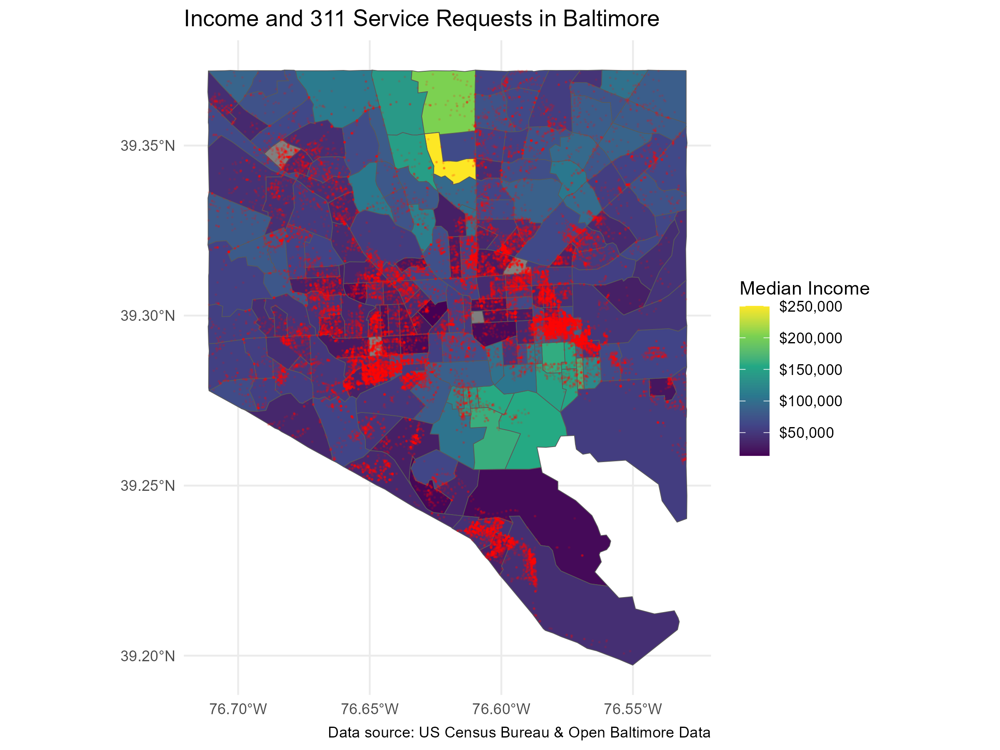

::: {.intro}

GIS student; interested in remote sensing, spatial data, spatial statistics, and human geography.

📍 Baltimore, Maryland

:::

## PORTFOLIO

::: {.project}

::: {.project-text}
### [Spatial Databases and Reproducible Mapping in R](ges_668/index.qmd)

`UMBC` `SPATIAL DATABASES` `R`

This project uses R, Quarto, and spatial data workflows to map and analyze Baltimore 311 service requests in relation to community-level patterns.

:::

::: {.project-image}

:::

:::

::: {.project}

::: {.project-text}
### [Remote Sensing Project](Remote-sensing-project.qmd)

`UMBC` `REMOTE SENSING` `ENVI`

This project uses satellite imagery and remote sensing methods to analyze land cover, vegetation, snow, wildfire, and surface temperature patterns.
:::

::: {.project-image}

:::

::: {.project}

::: {.project-text}

### [NYC Asian Population: LQ vs. FLQ](nyc-lq-flq.qmd)

`UMBC` `SPATIAL STATISTICS` `ARCGIS PRO`

This project compares traditional and spatially weighted Location Quotients to examine how neighboring Census tracts influence patterns of Asian population concentration across New York City.

:::

::: {.project-image}

[{.project-thumbnail fig-alt="Location Quotient map of Asian population concentration across New York City Census tracts"}](nyc-lq-flq.qmd)

:::
:::

::: {.sidebar-box}

### On this page

Portfolio

### Categories

human geography  
personal  
remote sensing  
umbc  

:::