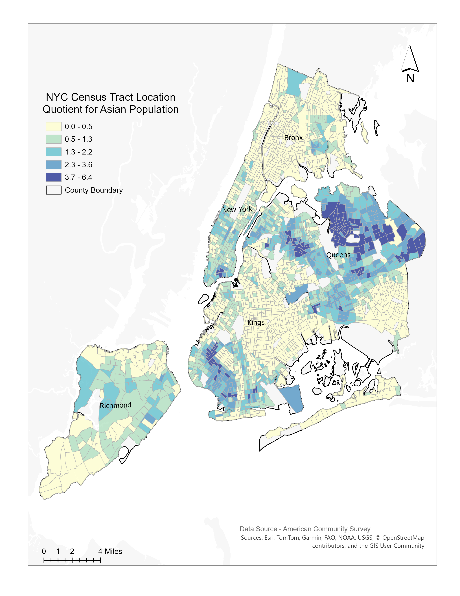
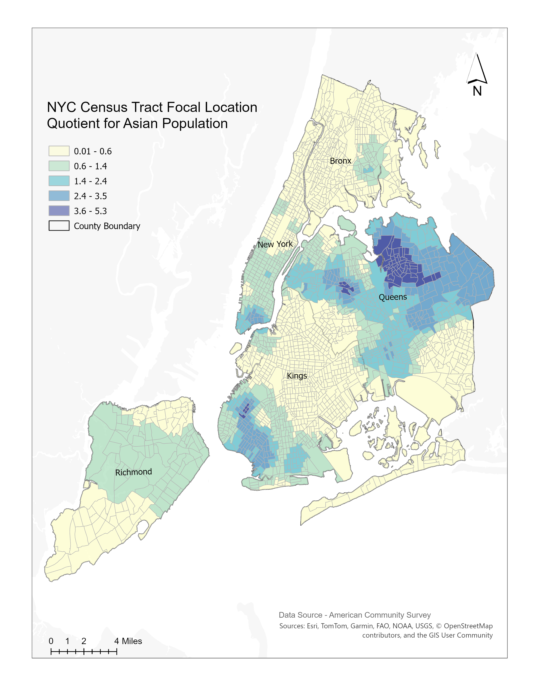
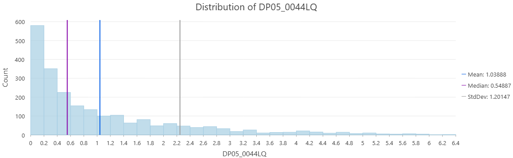
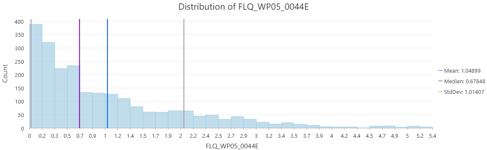

## Project Overview

This project examines the geographic concentration of New York City's Asian population across Census tracts by comparing the traditional Location Quotient (LQ) with the spatially weighted Focal Location Quotient (FLQ). While the LQ measures concentration within individual Census tracts, the FLQ incorporates the influence of nearby tracts using inverse-distance weighting. Comparing the two measures shows how including surrounding geographic context changes the interpretation of population concentration.

## Research Question

How does the geographic pattern of Asian population concentration change when neighboring Census tracts are incorporated into the Location Quotient calculation?

## Data and Methods

The analysis used American Community Survey data for New York City Census tracts, including total population and Asian population counts. The traditional Location Quotient was calculated for each tract by comparing its share of the Asian population with the Asian population share of New York City overall.

To incorporate surrounding geographic context, tract centroids were created and the 16 nearest neighboring tracts were identified for each focal tract. Inverse-distance weights were applied so that nearby tracts had greater influence than more distant tracts. The weighted population values were then used to calculate the Focal Location Quotient.

### Location Quotient

A Location Quotient greater than 1 indicates that the Asian population is over-represented in a Census tract compared with the citywide proportion. A value below 1 indicates under-representation.

### Focal Location Quotient

The Focal Location Quotient incorporates the surrounding population pattern rather than evaluating each tract independently. It helps determine whether an individual tract is part of a broader geographic area of concentration.

## Comparing the LQ and FLQ Maps

### Traditional Location Quotient

{fig-align="center" width="90%"}

The LQ map shows an uneven pattern of Asian population concentration across New York City. The strongest concentration appears in Queens, where many Census tracts have values above 1 and several fall within the highest LQ classes. Additional concentrations appear in western and southwestern Brooklyn, while much of the Bronx and Staten Island has lower values.

### Focal Location Quotient

{fig-align="center" width="90%"}

The FLQ map preserves the same broad geographic pattern but produces a smoother and more spatially continuous result. Queens remains the strongest concentration area, while the pattern in Brooklyn also becomes more generalized. This indicates that many high-concentration tracts are reinforced by similar values in nearby Census tracts rather than occurring as isolated locations.

### Main Comparison

The LQ identifies over- or under-representation within individual Census tracts, while the FLQ evaluates whether those tracts are part of a broader surrounding concentration. The results show that Asian population concentration in Queens is not limited to isolated high-value tracts but forms a larger spatially connected pattern.

## Comparing the Statistical Distributions

### Location Quotient Distribution

{fig-align="center" width="100%"}

The LQ distribution is strongly right-skewed. Most Census tracts have relatively low LQ values, while a smaller number of tracts have very high levels of Asian population concentration.

- **Mean:** 1.03888  
- **Median:** 0.54887  
- **Standard deviation:** 1.20147  

The mean is substantially higher than the median because a limited number of very high-LQ tracts pull the average upward.

### Focal Location Quotient Distribution

{fig-align="center" width="100%"}

The FLQ distribution remains right-skewed, but it is less dispersed than the LQ distribution.

- **Mean:** 1.04899  
- **Median:** 0.67848  
- **Standard deviation:** 1.01407  

Compared with the traditional LQ, the FLQ has a higher median and a lower standard deviation. This indicates that incorporating nearby tracts raised some lower values while reducing some extreme tract-level differences.

### Distribution Comparison

| Statistic | LQ | FLQ |
|---|---:|---:|
| Mean | 1.03888 | 1.04899 |
| Median | 0.54887 | 0.67848 |
| Standard deviation | 1.20147 | 1.01407 |

The two measures have similar means, but the FLQ has a higher median and lower standard deviation. This supports the map-based interpretation that spatial weighting produces a smoother and more geographically contextual pattern without completely changing the overall distribution.

## Key Takeaway

The traditional Location Quotient identifies population concentration within individual Census tracts, while the Focal Location Quotient incorporates the influence of nearby tracts. Both measures identify Queens as the strongest area of Asian population concentration, with additional concentrations in parts of Brooklyn and Manhattan.

The FLQ produces a smoother and more spatially continuous pattern than the traditional LQ. Its higher median and lower standard deviation indicate that incorporating neighboring tracts reduces some extreme tract-level differences while preserving the broader geographic pattern. The results show that many high-concentration tracts are part of larger, spatially connected areas rather than isolated locations.

## Limitations

The FLQ results depend on methodological choices, including the number of neighbors and the spatial weighting method. Using 16 nearest neighbors and inverse-distance weighting produces a locally smoothed pattern, but a different neighborhood definition could produce different results. Spatial smoothing may also reduce meaningful differences between individual Census tracts. Therefore, the LQ and FLQ are most useful when interpreted together rather than treating one measure as a replacement for the other.

## Tools and Skills

**Tools:** ArcGIS Pro, American Community Survey data

**Spatial methods:** Location Quotient, Focal Location Quotient, 16-nearest-neighbor analysis, inverse-distance weighting, distance decay

**Analytical skills:** Spatial data preparation, demographic analysis, choropleth mapping, descriptive statistics, histogram interpretation, and comparative spatial analysis